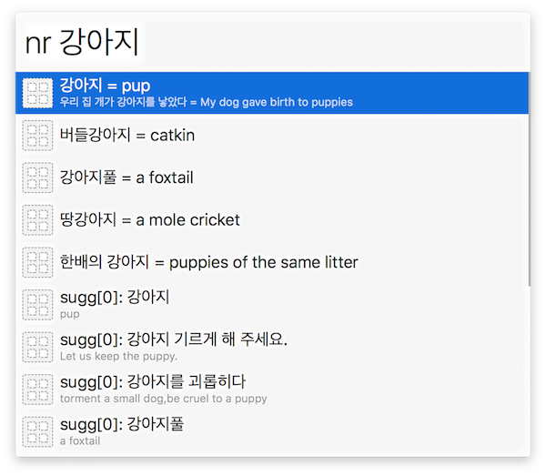

This workflow queries the Naver Korean-English dictionary (http://m.endic.naver.com/search.nhn?searchOption=all&query=cat).  It works in both directions: English-to-Korean and Korean-to-English.

It tries to intelligently compress the information returned from that site into single lines to show in Alfred.  These results may be copied to the clipboard by pressing "Command-C" while they are highlighted.

At the bottom of the results are autocomplete suggestions (scroll down!), which may be selected by pressing "tab".  They are either suggested by prefix (in which case they begin with "sugg[0]") or suffix ("sugg[1]")

This workflow may be activated with the keyword "nr", or by selecting any text and pressing "Ctrl-Command-T".  Due to Alfred's awkward internal use of Korean Jamo, you may have to type an extra space after a Korean word.

### Installing

This is simply an Alfred wrapper around <https://github.com/pjvandehaar/dotfiles/blob/master/bin/kor>.  That requires python 3.6+ and `pip3 install beautifulsoup4 lxml`.  Then modify the paths used in this workflow to point to your copy of `kor`.
